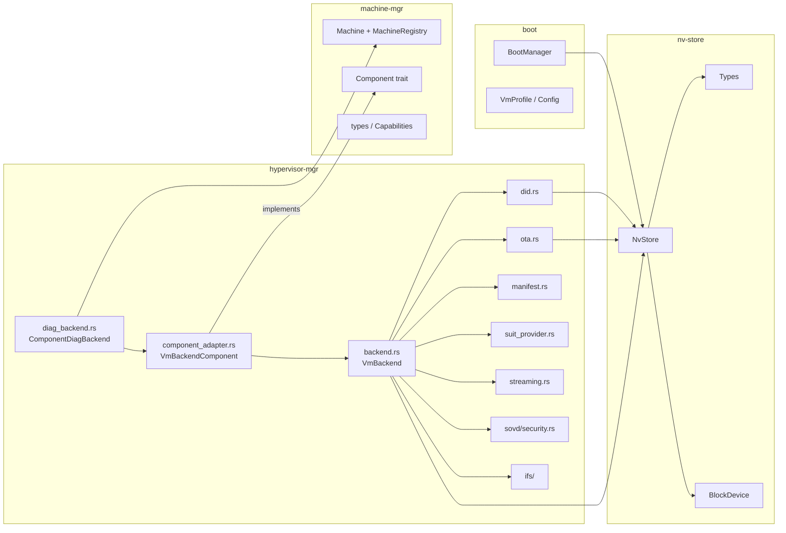
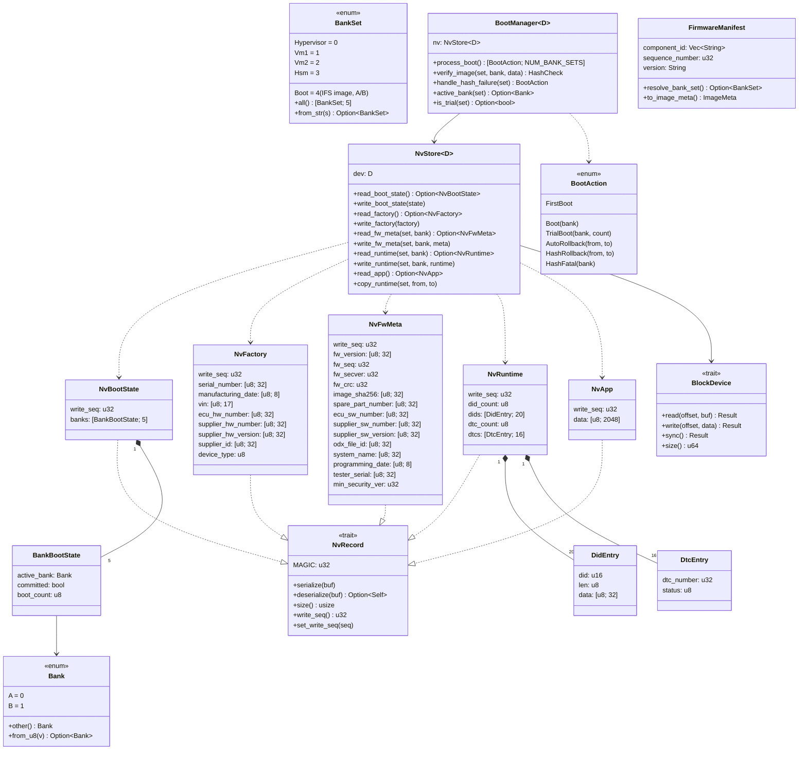
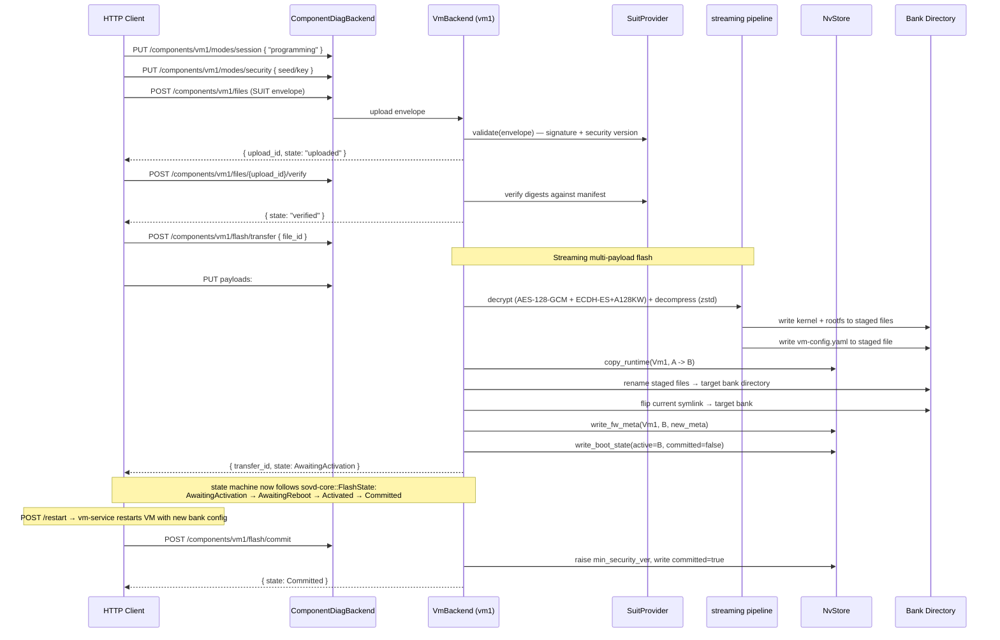
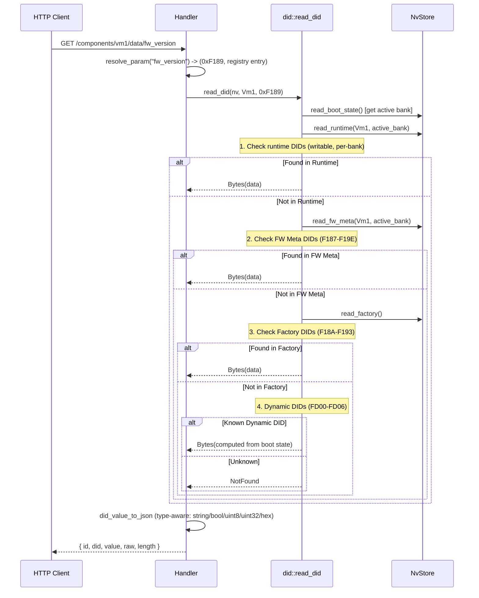
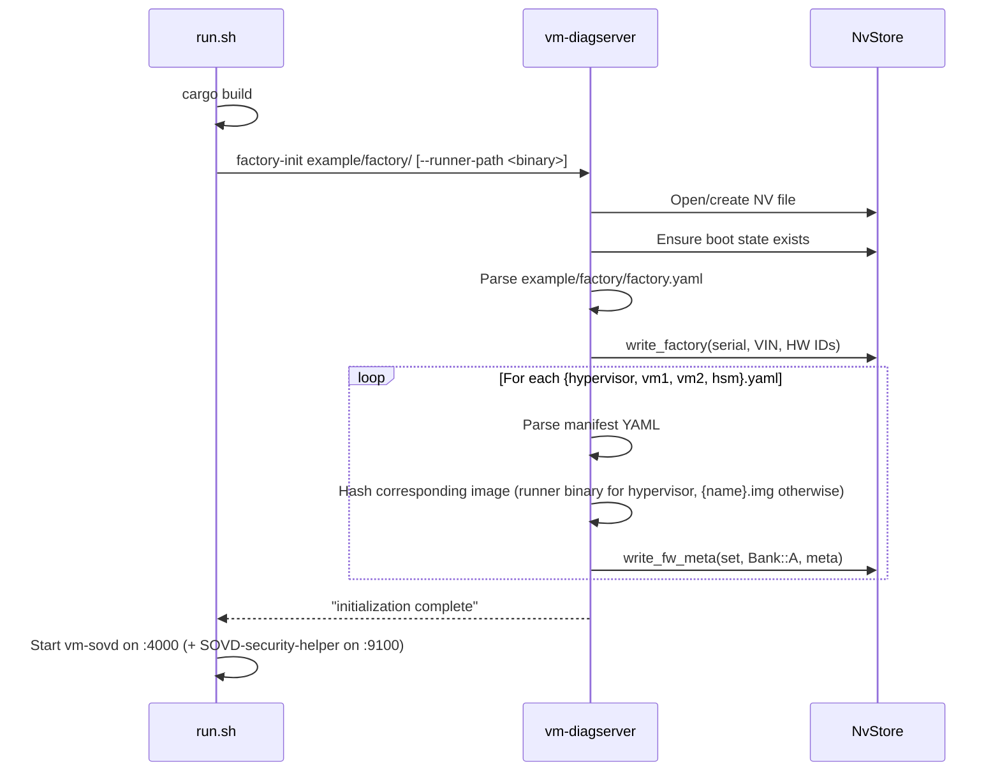

# Architecture: sumo-vm-mgr

## Overview

Platform-agnostic VM lifecycle manager for automotive ECUs. Handles A/B bank switching, boot decisions with trial boot and auto-rollback, OTA updates with SUIT manifest validation and encrypted firmware, and automotive diagnostics (UDS DIDs, DTCs) via SOVD REST API. Two-process architecture: `vm-service` (QEMU / qvm lifecycle) + `vm-sovd` (diagnostics/OTA). Developed and tested on Linux (file-backed storage + QEMU); the `machine-mgr` trait layer plus per-crate `BlockDevice` / `SharedMemory` / `HsmCryptoProvider` traits let the same business logic run on QNX (qvm hypervisor) once the concrete impls exist.

**Stack:** Rust 2021 edition, Axum 0.8 (HTTP), Tokio (async runtime), SHA-256 (image verification), CRC-32 (sector integrity), serde_yaml (manifests), SUIT envelopes (AES-128-GCM + ECDH-ES+A128KW encryption)

The workspace now spans nine crates (see `Cargo.toml`): `nv-store`, `secstore`, `vm-boot`, `hsm`, `vhsm-ssd`, `vm-devices`, `vm-service`, `machine-mgr`, `hypervisor-mgr`.

## Project Structure

```
sumo-vm-mgr/
+-- Cargo.toml                  # Workspace root (9 crates)
+-- CLAUDE.md                   # AI assistant instructions
+-- README.md                   # Project overview & quick start
+-- example/
|   +-- run.sh                  # Build + factory-init + start SOVD server + security helper
|   +-- build.sh                # Generate SUIT signing keys and demo encrypted firmware
|   +-- build_hsm_keys.rs       # Example: build an HSM key envelope
|   +-- factory/                # Example factory provisioning manifests
|   |   +-- factory.yaml        # Serial, VIN, HW IDs
|   |   +-- hypervisor.yaml     # Hypervisor firmware manifest (version, DIDs)
|   |   +-- vm1.yaml            # VM1 firmware manifest (version, DIDs)
|   |   +-- vm2.yaml            # VM2 firmware manifest (version, DIDs)
|   |   +-- hsm.yaml            # HSM firmware manifest (version, DIDs)
|   +-- config/secrets.toml     # SOVD-security-helper ECU secrets
|   +-- profiles/               # Per-VM TOML device profiles (vm1-*, etc.)
|   +-- templates/              # SUIT manifest templates (l2-encrypted, crl, hsm-keys)
|   +-- keys/                   # Generated SUIT signing keys
+-- specs/
|   +-- disk-layout.md          # GPT partition table specification
|   +-- nv-store-format.md      # NV partition internal layout & wire formats
|   +-- bank-state-machine.md   # Update lifecycle state machine
+-- crates/
    +-- nv-store/               # NV data types, sector-rotated storage, CRC integrity
    |   +-- src/
    |       +-- lib.rs           # Module exports
    |       +-- types.rs         # NvBootState, NvFactory, NvFwMeta, NvRuntime, NvApp, NvRecord trait
    |       +-- block.rs         # BlockDevice trait, MemBlockDevice, FileBlockDevice
    |       +-- store.rs         # NvStore<D> API, sector rotation read/write, NV layout offsets
    |       +-- tests.rs         # Roundtrip, rotation, corruption, isolation, copy-on-update
    +-- secstore/               # Encrypted key-metadata persistence
    |   +-- src/
    |       +-- lib.rs           # SecstoreEncryptor + SecstoreBackend traits, Secstore<E,B>
    |       +-- file_backend.rs  # FileBackend (atomic write-to-temp + rename)
    |       +-- linux_encryptor.rs # LinuxSimEncryptor (static key for dev)
    +-- boot/                   # Boot-time decision logic (platform-independent)
    |   +-- src/
    |       +-- lib.rs           # BootManager, BootAction, HashCheck, BootError
    |       +-- main.rs          # vm-boot CLI binary
    |       +-- config.rs        # VmProfile, VmConfig, DeviceConfig (TOML, serde)
    |       +-- tests.rs         # Boot cycle, hash verification, config parsing
    +-- hsm/                    # HSM provider trait + SimHsm (file keystore)
    |   +-- src/
    |       +-- lib.rs           # HsmProvider + HsmCryptoProvider traits
    |       +-- sim.rs           # SimHsm: spawns vhsm-ssd + file keystore
    |       +-- crypto.rs        # RustCrypto implementation of HsmCryptoProvider
    |       +-- payload.rs       # HsmKeystore CBOR schema
    |       +-- qnx.rs           # QnxHsm stub (real HSM via resource manager)
    +-- vhsm-ssd/               # Host-side daemon for v2 handle-based vHSM protocol
    |   +-- src/
    |       +-- lib.rs           # Module exports
    |       +-- proto.rs + codec.rs   # Wire format
    |       +-- handle_table.rs  # Dynamic handle allocator (0x0100+)
    |       +-- policy.rs        # Per-CID ACL
    |       +-- handler.rs       # Op dispatch → HsmCryptoProvider
    |       +-- transport.rs     # vsock (Linux/QEMU) + QNX shm/IPC
    +-- vm-devices/             # Host-side virtual CAN / health / time simulators
    |   +-- src/
    |       +-- lib.rs           # Module exports
    |       +-- transport.rs     # ivshmem vs QNX shm abstraction
    |       +-- clock.rs         # Real-time / simulation-stepping / gPTP
    |       +-- regs.rs          # Shared-memory register layout
    |       +-- can.rs + health.rs + time.rs # Per-device simulators
    +-- vm-service/             # VM lifecycle manager (QEMU/qvm process management)
    |   +-- src/
    |       +-- main.rs          # vm-service binary
    |       +-- config.rs        # VmServiceConfig, VmDefinition, VmBankConfig (per-bank overrides)
    |       +-- manager.rs       # VmManager: start/stop/restart VMs, IPC listener
    |       +-- api.rs           # Unix-socket / TCP control protocol
    |       +-- health.rs        # HealthMonitor (liveness)
    |       +-- ivshmem.rs       # ivshmem-server lifecycle (Linux)
    |       +-- runner/qemu.rs   # QemuRunner: QEMU process launch + arg builder
    |       +-- runner/qnx.rs    # QnxRunner: qvm stub for production
    |       +-- runner/dummy.rs  # DummyRunner: no-op for components without a VM
    +-- machine-mgr/            # Platform-agnostic Machine + Component trait layer
    |   +-- src/
    |       +-- lib.rs           # Hierarchy doc + sovd-core re-exports
    |       +-- component.rs     # Component trait (async, ~35 methods with NotSupported defaults)
    |       +-- machine.rs       # Machine trait + MachineRegistry composition
    |       +-- types.rs         # Capabilities, FlashCaps, LifecycleCaps, HsmCaps, DidKind, FlashId, ...
    |       +-- error.rs         # MachineError (NotSupported / NotFound / PolicyRejected / ...)
    +-- hypervisor-mgr/         # SOVD wire adapter, SUIT OTA engine, DID resolution
        +-- src/
            +-- lib.rs           # Module exports + layering doc
            +-- main.rs          # vm-diagserver CLI binary (status/install/commit/rollback/dids/factory-init)
            +-- sovd_main.rs     # vm-sovd HTTP server binary (Axum + Tokio)
            +-- backend.rs       # VmBackend: legacy per-bank-set state machine, ComponentConfig
            +-- component_adapter.rs # VmBackendComponent: exposes VmBackend via Component
            +-- diag_backend.rs  # ComponentDiagBackend: routes sovd-core::DiagnosticBackend → Component
            +-- suit_provider.rs # SUIT envelope validation (signature, digest, secver)
            +-- manifest_provider.rs # ManifestProvider trait (pluggable validation)
            +-- manifest.rs      # YAML FirmwareManifest / FactoryManifest for factory-init
            +-- streaming.rs     # Streaming payload pipeline (decrypt + decompress + hash)
            +-- did.rs           # DID resolution (Runtime > FwMeta > Factory > Dynamic)
            +-- ota.rs           # OTA install/commit/rollback engine
            +-- ifs/             # Boot-image (IFS) activation (mount + copy on Linux / QNX)
            +-- sovd/security.rs # SecurityProvider trait + TestSecurityProvider
```

## System Architecture

```mermaid
graph TB
    subgraph Binaries
        VMB["vm-boot<br/>(CLI diagnostic)"]
        VMD["vm-diagserver<br/>(CLI: status/install/commit/...)"]
        VMV["vm-service<br/>(QEMU / qvm lifecycle daemon)"]
        VMS["vm-sovd<br/>(HTTP server :4000)"]
        VHSM["vhsm-ssd<br/>(vHSM v2 daemon)"]
    end

    subgraph "vm-boot crate (lib)"
        BM["BootManager&lt;D&gt;"]
        CFG["VmProfile / Config"]
    end

    subgraph "hypervisor-mgr crate (lib)"
        DIAG["ComponentDiagBackend<br/>(SOVD wire adapter)"]
        ADAPT["VmBackendComponent<br/>(Component impl)"]
        VMBK["VmBackend&lt;D&gt;<br/>(per-component state)"]
        DID["DID Resolution"]
        OTA["OTA Engine"]
        STRM["Streaming Pipeline<br/>(decrypt + decompress)"]
        MANI["SUIT / YAML Manifest"]
        IFS["IFS Activator"]
        SEC["SecurityProvider"]
    end

    subgraph "machine-mgr crate (lib)"
        MACH["Machine + MachineRegistry"]
        COMP["Component trait"]
        CAPS["Capabilities / types"]
    end

    subgraph "vm-service crate (lib+bin)"
        MGR["VmManager"]
        QR["QemuRunner"]
        QNR["QnxRunner (stub)"]
        IVS["ivshmem-server mgmt"]
        HMON["HealthMonitor"]
    end

    subgraph "hsm + vhsm-ssd crates"
        HSMP["HsmProvider<br/>(SimHsm / QnxHsm)"]
        HCP["HsmCryptoProvider"]
        POL["Policy / HandleTable"]
    end

    subgraph "vm-devices crate (lib)"
        VCAN["CAN / Health / Time sims"]
        CLK["Clock (real / sim / gPTP)"]
    end

    subgraph "nv-store + secstore crates"
        NVS["NvStore&lt;D&gt;"]
        BD["BlockDevice trait"]
        TY["NV Types<br/>(BootState, Factory,<br/>FwMeta, Runtime, App)"]
        SSTORE["Secstore&lt;E,B&gt;<br/>(key metadata)"]
    end

    subgraph External
        QEMU["QEMU / qvm"]
        NVP["NV Partition<br/>(file or block device)"]
        SIM["Device simulators"]
        HTTP["HTTP Clients<br/>(curl, SOVD Explorer)"]
        YAML["YAML Manifests<br/>(example/factory/)"]
        GUEST["Guest /dev/vhsm"]
    end

    VMB --> BM
    VMD --> DID
    VMD --> OTA
    VMD --> MANI
    VMV --> MGR
    MGR --> QR
    MGR --> QNR
    MGR --> IVS
    MGR --> HMON
    VMS --> DIAG
    DIAG --> MACH
    MACH --> COMP
    ADAPT -- implements --> COMP
    ADAPT --> VMBK
    VMBK --> DID
    VMBK --> OTA
    VMBK --> STRM
    VMBK --> MANI
    VMBK --> SEC
    VMBK --> IFS
    VMBK --> HSMP

    BM --> NVS
    DID --> NVS
    OTA --> NVS
    VMBK --> NVS
    SSTORE --> BD
    VHSM --> HCP
    VHSM --> POL
    VHSM --> SSTORE
    HSMP --> HCP
    MGR --> VCAN
    VCAN --> CLK

    QR --> QEMU
    IVS --> SIM
    VCAN --> SIM
    NVS --> BD
    BD --> NVP
    HTTP --> VMS
    GUEST --> VHSM
    MANI --> YAML
```



## Module Hierarchy

### nv-store

| Module | Purpose | Key Exports |
|--------|---------|-------------|
| `types` | NV record types and manual LE serialization | `Bank`, `BankSet`, `BankBootState`, `NvBootState`, `NvFactory`, `NvFwMeta`, `NvRuntime`, `NvApp`, `DidEntry`, `DtcEntry`, `NvRecord` trait |
| `block` | Block device abstraction | `BlockDevice` trait, `BlockError`, `MemBlockDevice`, `FileBlockDevice` |
| `store` | High-level NV API with sector rotation | `NvStore<D>`, `read_record`, `write_record`, `layout` module, `SECTOR_SIZE`, `MIN_NV_DEVICE_SIZE` |

**Dependencies:** `crc32fast`

### secstore

| Module | Purpose | Key Exports |
|--------|---------|-------------|
| `lib` | Encrypted key-metadata store | `SecstoreEncryptor` + `SecstoreBackend` traits, `Secstore<E, B>`, `KeyMetadata`, `SecstoreError` |
| `file_backend` | POSIX file backend | `FileBackend` (atomic write-to-temp + rename) |
| `linux_encryptor` | Dev encryptor | `LinuxSimEncryptor` (static AES key) |

**Dependencies:** `aes-gcm`, `tempfile`

### vm-boot

| Module | Purpose | Key Exports |
|--------|---------|-------------|
| `lib` | Boot decision engine | `BootManager<D>`, `BootAction` (6 variants), `HashCheck`, `BootError` |
| `config` | TOML profile parsing | `VmProfile`, `VmConfig`, `DeviceConfig` (7 variants: Can, Health, Time, Hsm, Network, Disk, Console), `Arch` |
| `main` | CLI entry point | `vm-boot <nv-path> [--init]` |

Launching / stopping VMs is no longer a `BootBackend` trait in this crate; it's the `VmRunner` trait in `vm-service` (see below).

**Dependencies:** `nv-store`, `sha2`, `serde`, `toml`

### hsm

| Module | Purpose | Key Exports |
|--------|---------|-------------|
| `lib` | HSM management + crypto trait | `HsmProvider`, `HsmCryptoProvider`, `KeyRole`, `KeyInfo`, `HsmError`, `ProvisioningState` |
| `sim` | Dev/test provider | `SimHsm` (spawns `vhsm-ssd` + file keystore) |
| `crypto` | Software crypto | RustCrypto implementation of `HsmCryptoProvider` |
| `payload` | Keystore CBOR schema | `HsmKeystore` (SUIT-envelope-carried key material) |
| `qnx` | Production stub | `QnxHsm` (waiting on HSE integration) |

**Dependencies:** `cbor` / `coset`, `sha2`, `aes-gcm`, `p256`, `pkcs8`, optional `rustcrypto` feature

### vhsm-ssd

| Module | Purpose | Key Exports |
|--------|---------|-------------|
| `proto` + `codec` | v2 handle-based vHSM wire format | Frame parser / serializer |
| `handle_table` | Dynamic handle allocator | Well-known (`0x0001..=0x00FF`) + dynamic (`0x0100+`) handles |
| `policy` | Per-CID ACL | Enforced before every op dispatch |
| `handler` | Op dispatch | Delegates crypto to `HsmCryptoProvider` |
| `transport` | Wire transports | vsock (Linux/QEMU), QNX-native shm/IPC |

**Dependencies:** `hsm` (with `crypto` feature), `secstore`, `tokio`, `bytes`

### vm-devices

| Module | Purpose | Key Exports |
|--------|---------|-------------|
| `transport` | Shared-memory abstraction | ivshmem vs QNX native shm |
| `clock` | Clock abstraction | Real-time / simulation-stepping / gPTP-corrected |
| `regs` | Register layout | Shared-memory register map for all device sims |
| `can` / `health` / `time` | Per-device simulators | Feature-gated |
| `qmp` | QEMU monitor integration | Linux-only |

### vm-service

| Module | Purpose | Key Exports |
|--------|---------|-------------|
| `config` | VM definition + per-bank overrides | `VmServiceConfig`, `VmDefinition`, `VmBankConfig`, `BackendType` |
| `manager` | VM lifecycle management | `VmManager` (start/stop/restart VMs, IPC socket listener), `StopHandle` |
| `api` | Control protocol | Unix socket (Linux) / TCP (QNX) request handling |
| `health` | Liveness monitoring | `HealthMonitor`, `HealthStatus`, `HealthDetail` |
| `ivshmem` | ivshmem-server lifecycle | `HostProcess`, server launch + cleanup (Linux) |
| `runner/qemu` | QEMU process launch | `QemuRunner` (arg builder, KVM detection) |
| `runner/qnx` | qvm stub | `QnxRunner` (placeholder for production) |
| `runner/dummy` | No-op runner | `DummyRunner` (for components without a VM) |
| `main` | Service binary | `vm-service --config <yaml>` |

**Dependencies:** `vm-devices`, `serde`, `serde_yaml`, `tokio`, `tracing`, `libc`

### machine-mgr

| Module | Purpose | Key Exports |
|--------|---------|-------------|
| `component` | Async component trait | `Component` (`id`, `capabilities`, + DID / install / lifecycle / HSM methods, all defaulted to `NotSupported`), `DidEntry` |
| `machine` | Top-level registry | `Machine` trait, `MachineRegistry`, `MachineRegistryBuilder` |
| `types` | Domain types | `Capabilities`, `FlashCaps`, `LifecycleCaps`, `HsmCaps`, `DidKind`, `DidFilter`, `DtcFilter`, `FlashId`, `FlashSession`, `RuntimeState`, `Csr`, `EnvelopeStream` |
| `error` | Error enum | `MachineError` (`NotSupported`, `NotFound`, `InvalidArgument`, `PolicyRejected`, `ManifestInvalid`, `UnknownFlashSession`, `Storage`, `Internal`), `MachineResult` |

Re-exports `ActivationState`, `FlashState`, `FlashStatus`, `FlashProgress`, `Fault`, `FaultsResult`, `ClearFaultsResult`, `PackageInfo`, `VerifyResult`, `EntityInfo`, `ParameterInfo`, `DataValue` from `sovd-core`.

**Dependencies:** `async-trait`, `bytes`, `serde`, `sovd-core`

### hypervisor-mgr

| Module | Purpose | Key Exports |
|--------|---------|-------------|
| `backend` | Legacy per-component state machine | `VmBackend<D>` (implements `sovd-core::DiagnosticBackend` historically), `ComponentConfig` |
| `component_adapter` | Component impl | `VmBackendComponent<D>` — thin wrapper that exposes `VmBackend` via `machine_mgr::Component` |
| `diag_backend` | SOVD wire adapter | `ComponentDiagBackend` — routes `sovd-core::DiagnosticBackend` calls through to `Component` |
| `suit_provider` | SUIT envelope validation | `SuitProvider` (signature, digest, security version checks) |
| `manifest_provider` | Validation trait | `ManifestProvider` (pluggable) |
| `manifest` | Factory YAML | `FirmwareManifest`, `FactoryManifest`, `ImageMeta` |
| `streaming` | Upload pipeline | Streaming decrypt (AES-128-GCM + ECDH-ES+A128KW) + decompress (zstd) |
| `did` | DID resolution | `read_did`, `write_did`, `DidValue`, DID constants (F187-F19E + FD00-FD06) |
| `ota` | OTA lifecycle | `install`, `commit`, `rollback`, `status`, `OtaError`, `BankStatus` |
| `ifs` | Boot-image activation | `IfsActivator` trait, `IfsError`, `dev::` + `hardware::` impls |
| `sovd/security` | Security provider | `SecurityProvider` trait, `TestSecurityProvider` (XOR 0xFF for dev) |
| `main` | CLI | `vm-diagserver <nv-path> <cmd> [...]` |
| `sovd_main` | HTTP server | `vm-sovd <nv-path> <provisioning-authority> [options] [bind-addr]` |

**Dependencies:** `nv-store`, `machine-mgr`, `hsm` (crypto feature), `sovd-core`, `sovd-api`, `sumo-onboard`, `sumo-processor`, `sumo-crypto`, `sumo-codec`, `axum`, `tokio`, `tracing`, `coset`, `ruzstd`



## Core Types



## Data Flow

### Boot Sequence

```mermaid
sequenceDiagram
    participant S as vm-service
    participant BM as BootManager
    participant NV as NvStore
    participant R as QemuRunner
    participant IVS as ivshmem / vm-devices
    participant VM as QEMU / qvm

    S->>NV: Open NV store (FileBlockDevice)
    S->>BM: process_boot()
    BM->>NV: read_boot_state()
    NV-->>BM: NvBootState (NUM_BANK_SETS entries)

    alt First Boot
        BM->>NV: write_boot_state(defaults)
        BM-->>S: [FirstBoot; NUM_BANK_SETS]
    else Committed
        BM-->>S: Boot { bank }
    else Trial (count <= MAX_TRIAL_BOOTS)
        BM->>NV: write_boot_state(count+1)
        BM-->>S: TrialBoot { bank, count }
    else Trial (count > MAX_TRIAL_BOOTS)
        BM->>NV: write_boot_state(other bank, committed)
        BM-->>S: AutoRollback { from, to }
    end

    S->>R: start(name, def)
    R->>IVS: Start ivshmem-server(s) + device sims (health, time, CAN)
    R->>R: build QEMU / qvm args per VmDefinition + VmBankConfig
    R->>VM: Launch (spawn)
    S->>VM: HealthMonitor polls liveness
    VM-->>R: Exit
    S->>R: stop / cleanup (kill processes, remove sockets, clean /dev/shm)
    Note over S: control-socket clients can request restart, which re-runs process_boot
```

### OTA Update via SOVD (Full Flash Flow)



### DID Resolution



### Factory Initialization



## State Management

| State | Type | Location | Reads | Writes |
|-------|------|----------|-------|--------|
| Boot State | `NvBootState` (`NUM_BANK_SETS` x `BankBootState`) | NV offset 0x0, 2 sectors | `process_boot`, `status`, `read_did` (dynamic DIDs), `install`, `commit`, `rollback` | `process_boot`, `install`, `commit`, `rollback` |
| Factory Data | `NvFactory` | NV offset 0x2000, 2 sectors | `read_did` (F18A-F193) | `provision`, `factory-init` (write-once) |
| FW Metadata | `NvFwMeta` (per set, per bank) | NV offset 0x10000+, 4 sectors each | `read_did` (F187-F19E), `verify_image`, `status`, `install` (anti-rollback check) | `install`, `commit` (raise floor), `factory-init` |
| Runtime DIDs/DTCs | `NvRuntime` (per set, per bank) | NV offset varies, 8 sectors each | `read_did`, `list_faults` | `write_did`, `install` (copy-on-update), `clear_faults` |
| App Data | `NvApp` | NV offset 0x4000, 2 sectors | (reserved) | (reserved) |
| Secstore blobs | `Secstore<E, B>` (key metadata) | File backend (dev) or board-specific | `vhsm-ssd` handler on every op | `vhsm-ssd` on key generate / delete |
| SOVD shared state | `Arc<dyn Machine>` wrapping per-component `Arc<Mutex<VmBackend<D>>>` | In-memory (Tokio) | All SOVD handlers | All mutating handlers |
| Upload/transfer state | Per-component mutex-guarded maps inside `VmBackend` | In-memory (Tokio) | upload status / verify / transfer handlers | upload / verify / transfer handlers |
| VM process state | `VmManager` / per-runner `HostProcess` tracking | In-memory (vm-service) | `VmManager::status`, HealthMonitor | `start`, `stop`, `restart`, `Drop` |

**NV State Lifecycle:**
- **Initialized:** First call to `process_boot()`, `vm-boot --init`, or `vm-diagserver` / `vm-sovd` auto-creates
- **Provisioned:** `factory-init` or `provision` writes factory + FW meta (one-time)
- **Updated:** OTA install writes FW meta + boot state; commit/rollback modifies boot state
- **Persisted:** Every NV write calls `dev.sync()` for power-loss safety
- **Rotated:** Each write goes to next sector slot; reads pick highest valid `write_seq`

## API / Command Reference

### CLI: vm-boot

| Command | Description |
|---------|-------------|
| `vm-boot <nv-path>` | Process boot decisions, print actions for all bank sets |
| `vm-boot <nv-path> --init` | Create NV file if missing, then process boot |

### CLI: vm-diagserver

| Command | Description |
|---------|-------------|
| `vm-diagserver <nv> status <set>` | Show bank status (active bank, committed, boot count, versions) |
| `vm-diagserver <nv> install <set> <image> <ver> <secver>` | Install OTA image to inactive bank (raw image, for local testing) |
| `vm-diagserver <nv> commit <set>` | Commit trial bank, raise anti-rollback floor |
| `vm-diagserver <nv> rollback <set>` | Rollback to previous bank |
| `vm-diagserver <nv> read-did <set> <did-hex>` | Read DID value (e.g., F189, 0xFD04) |
| `vm-diagserver <nv> write-did <set> <did-hex> <val>` | Write runtime DID |
| `vm-diagserver <nv> provision <serial> <vin>` | Write factory data (one-time) |
| `vm-diagserver <nv> factory-init <dir> [--runner-path <path>]` | Initialize from YAML manifests in directory |

`<set>` is one of `hypervisor`, `vm1`, `vm2`, `hsm` (with legacy aliases `hyp`, `os1`, `os2`, and `boot`/`qtd` for the IFS bank). The production OTA path is SUIT envelopes over the SOVD HTTP API — the CLI `install` command is a dev-only fast-path that skips SUIT validation.

### Binary: vm-service

| Invocation | Description |
|------------|-------------|
| `vm-service --config <path.yaml>` | VM lifecycle daemon. Loads a `VmServiceConfig`, auto-starts any VMs flagged `auto_start`, and exposes a control API on a Unix socket (Linux) or TCP port (QNX). |

### HTTP: vm-sovd (SOVD REST API)

Wire-compatible with `sovd-core` / `sovd-api`. The surface below is the current adapter — see `sovd-api` for the canonical schema.

| Method | Path | Description |
|--------|------|-------------|
| GET | `/vehicle/v1/components` | List components (hypervisor, vm1, vm2, hsm) with capabilities |
| GET | `/vehicle/v1/components/{id}` | Get single component info |
| GET | `/vehicle/v1/components/{id}/data` | List all DIDs (standard + runtime DIDs) |
| GET | `/vehicle/v1/components/{id}/data/{param}` | Read DID by name (`fw_version`) or hex (`F189`, `0xF189`) |
| PUT | `/vehicle/v1/components/{id}/data/{param}` | Write runtime DID (`{"value": "..."}`) — read-only DIDs return 403 |
| GET | `/vehicle/v1/components/{id}/faults` | List DTCs with status and active flag |
| DELETE | `/vehicle/v1/components/{id}/faults` | Clear all DTCs |
| PUT | `/vehicle/v1/components/{id}/modes/session` | Set diagnostic session (e.g. `programming`) |
| PUT | `/vehicle/v1/components/{id}/modes/security` | Seed/key security unlock |
| POST | `/vehicle/v1/components/{id}/files` | Upload SUIT envelope (octet-stream body) |
| GET | `/vehicle/v1/components/{id}/files/{upload_id}` | Get upload status |
| POST | `/vehicle/v1/components/{id}/files/{upload_id}/verify` | Verify digests against manifest |
| POST | `/vehicle/v1/components/{id}/flash/transfer` | Start flash transfer |
| GET | `/vehicle/v1/components/{id}/flash/transfer/{id}` | Get transfer progress |
| PUT | `/vehicle/v1/components/{id}/flash/transfer/{id}` | Stream encrypted payloads (`#kernel`, `#firmware`, `#config`) |
| GET | `/vehicle/v1/components/{id}/flash/activation` | Get activation state (see `FlashState`: `AwaitingActivation`, `AwaitingReboot`, `Activated`, `Committed`, `RolledBack`, `Failed`) |
| POST | `/vehicle/v1/components/{id}/flash/commit` | Commit trial bank |
| POST | `/vehicle/v1/components/{id}/flash/rollback` | Rollback trial bank |

### Script: run.sh

| Command | Description |
|---------|-------------|
| `./example/run.sh` | Build, factory-init, start SOVD server (:4000) + SOVD-security-helper (:9100) |
| `./example/run.sh --fresh` | Wipe NV store first |
| `./example/run.sh --no-init` | Skip factory initialization |
| `./example/run.sh --addr <host:port>` | Custom SOVD bind address |
| `./example/run.sh --profile <toml> --images <dir>` | Full boot loop variant (depends on a `vm-runner` binary that is not currently built) |

### Script: build.sh

| Command | Description |
|---------|-------------|
| `./example/build.sh` | Generate SUIT signing keys, reference manifests, and encrypted demo firmware for the integration tests |

## External Dependencies

### Runtime

| Crate | Version | Purpose | Replaceable? |
|-------|---------|---------|-------------|
| `crc32fast` | 1 | CRC-32 for NV sector integrity | Any CRC-32 lib |
| `sha2` | 0.10 | SHA-256 image verification | Any SHA-256 lib |
| `serde` | 1 | Serialization framework (TOML, JSON, YAML) | Core dependency |
| `toml` | 0.8 | VM profile config parsing | Any TOML parser |
| `serde_json` | 1 | SOVD API JSON request/response | Tied to Axum |
| `serde_yaml` | 0.9 | Firmware/factory manifest parsing | Any YAML parser |
| `axum` | 0.8 | HTTP framework for SOVD server | Any async HTTP framework |
| `tokio` | 1 | Async runtime (rt-multi-thread, macros, net) | Required by Axum |
| `async-trait` | 0.1 | `async` in the `Component` trait | Required until native async-trait |
| `tracing` | 0.1 | Structured logging | Any logging framework |
| `tracing-subscriber` | 0.3 | Log output with env-filter | Any log subscriber |
| `libc` | 0.2 | Process existence check (`kill(pid, 0)`), signal handling | Direct syscall |
| `bytes` | 1 | Zero-copy buffers for the streaming pipeline | Any buffer type |
| `ruzstd` | 0.7 | zstd decompression for SUIT payloads | `zstd` crate |
| `coset` | 0.3 | COSE envelope parsing (SUIT + HSM keys) | Any COSE lib |
| `futures` | 0.3 | Stream combinators for upload pipeline | Required |
| `tokio-util` | 0.7 | `io` integration for streaming body → async-read | Required |
| `sovd-core` / `sovd-api` | git | SOVD wire types + `DiagnosticBackend` trait | Owned by the SOVDd project |
| `sumo-onboard` / `sumo-crypto` / `sumo-codec` / `sumo-processor` | git | SUIT validation, streaming crypto, decompression, command interpreter | Owned by the sumo-rs project |

### Dev/Test Only

| Crate | Version | Purpose |
|-------|---------|---------|
| `http-body-util` | 0.1 | Body extraction in SOVD integration tests |
| `tower` | 0.5 | `ServiceExt::oneshot()` for test HTTP calls |
| `hyper` | 1 | Low-level HTTP for test request building |
| `ciborium` | 0.2 | CBOR roundtrip in unit tests |
| `tempfile` | 3 | Temp dirs/files in integration tests |
| `sumo-offboard` | git | Test-side SUIT envelope builder |

## Design Patterns & Decisions

### Generic over BlockDevice
`NvStore<D: BlockDevice>` and `BootManager<D>` are parameterized over the storage backend. Tests use `MemBlockDevice` (in-memory), development uses `FileBlockDevice`, production targets raw block devices. This makes all logic testable without I/O.

### Sector Rotation for Power-Loss Safety
Each NV region has 2-8 rotated sectors. Writes go to the sector with the lowest `write_seq` (or first empty/uninitialized sector); reads pick the sector with the highest valid `write_seq` and correct CRC. This provides: wear leveling, atomic writes (old sector valid until new one committed), and automatic corruption recovery (skip sectors with bad CRC).

### NvRecord Trait for Uniform Serialization
All NV types implement `NvRecord` with a common pattern: 4-byte magic, 4-byte write_seq, payload, CRC at sector end. This allows generic `read_record<T>` / `write_record<T>` functions. Wire format is manual little-endian byte packing (no serde) for deterministic binary layout.

### Runner Trait for Hypervisor Abstraction
`VmRunner` (in `vm-service::runner`) abstracts VM launch/stop/wait/cleanup. `QemuRunner` is the full Linux development implementation (ivshmem-server management via `vm-service::ivshmem`, device-simulator lifecycle via `vm-devices`, QEMU arg construction, cleanup on `Drop`). `QnxRunner` is a stub for production QNX qvm integration; `DummyRunner` is a no-op for components that don't own a VM (e.g. HSM, IFS). Device simulators, shared-memory transport, and clocks live in `vm-devices` so the same code compiles on Linux (ivshmem) and QNX (native shm).

### Component Trait for Semantic API
`machine_mgr::Component` is the per-component async API behind the SOVD wire adapter. Each `Component` declares `Capabilities` and exposes only the operations it actually supports — everything else has a `NotSupported` default. Today every concrete component is a `hypervisor_mgr::component_adapter::VmBackendComponent<D>` wrapping a `VmBackend<D>` bound to a `BankSet`; as the rewrite progresses, more methods will be implemented directly on the adapter and the legacy `VmBackend` surface will shrink.

### SOVD Wire Adapter
`hypervisor_mgr::diag_backend::ComponentDiagBackend` implements `sovd-core::DiagnosticBackend`. It holds an `Arc<dyn Machine>` and routes each SOVD call to the appropriate `Component`. Wire compatibility with `sovd-client` and the SOVD Explorer stays intact; machine-side code sees only the `Component` trait.

### DID Resolution Priority Chain
Runtime (writable, per-bank) > FW Meta (software identity, per-bank) > Factory (hardware identity, shared) > Dynamic (computed from boot state). This mirrors automotive UDS conventions where workshop-written values override factory defaults. Dynamic DIDs (0xFD00-FD06) are computed on-the-fly from boot state and health telemetry.

### Copy-on-Update
Before OTA writes to the inactive bank, runtime DIDs and DTCs are cloned from the active bank. This preserves user configuration across updates. If the source bank has no runtime data, an empty default is written.

### Anti-Rollback Floor
Each bank tracks `min_security_ver`. The floor is only raised on explicit commit (not on install), allowing rollback during trial. Once raised, images with lower security versions are permanently rejected. The floor is preserved from active bank to target bank during install.

### Independent Bank Sets
Hypervisor, VM1, and VM2 have completely independent A/B state machines with separate NV regions. This enables staged rollouts: update vm1, verify, commit, then update vm2. Different bank sets can be in different states simultaneously. The HSM component uses a single bank (no A/B, no rollback).

### Multi-Component SUIT Envelopes
Firmware updates use SUIT envelopes with multiple components: kernel (#kernel), rootfs (#firmware), and VM config (#config). All payloads are compressed (zstd) and encrypted (AES-128-GCM + ECDH-ES+A128KW) per-device. The VM config (vm-config.yaml) is delivered alongside firmware so it rolls back automatically with the firmware bank.

### Per-Component Mutex for SOVD Concurrency
The HTTP server holds an `Arc<dyn Machine>`; each component is an `Arc<Mutex<VmBackend<D>>>` under the adapter. Multiple Axum handlers can safely share mutable access to the same component, and the four components lock independently. Upload/transfer state is separately mutex'd inside `VmBackend` to avoid contention with NV writes.

### QEMU Device Enumeration
Devices are added in reverse order in QEMU args because the virt machine enumerates PCI devices in reverse. This ensures rootfs is always `/dev/vda`, data is `/dev/vdb`, etc.

### Encrypted Key Metadata (Secstore)
The `secstore` crate separates "where bytes live" (`SecstoreBackend`) from "how they are encrypted" (`SecstoreEncryptor`). Dev builds pair `FileBackend` with `LinuxSimEncryptor` (static AES key). Production replaces the encryptor with an HSE-backed implementation so the wrapping key never leaves the secure boundary. `vhsm-ssd` is the single writer — writes are atomic (write-to-temp + rename) to survive power loss.

## Recreation Blueprint

### 1. Project Scaffolding

```bash
cargo init --name sumo-vm-mgr
# Convert to workspace
mkdir -p crates/{nv-store,secstore,boot,hsm,vhsm-ssd,vm-devices,vm-service,machine-mgr,hypervisor-mgr}/src
mkdir -p specs example/{factory,profiles,templates,config,keys}
# Edit Cargo.toml: [workspace] resolver = "2", members = [...]
```

### 2. Core Types to Define First (nv-store)

1. `Bank` enum (A/B) with `other()` and `from_u8()`, and `BankSet` enum (Hypervisor/Vm1/Vm2/Hsm/Boot) with `from_str()` and `all()`
2. `BlockDevice` trait with `read`, `write`, `sync`, `size`
3. `MemBlockDevice` (for tests) and `FileBlockDevice` (open + create)
4. `NvRecord` trait with `MAGIC`, `serialize`, `deserialize`, `size`, `write_seq`, `set_write_seq`
5. Helper functions: `put_u32_le`, `get_u32_le`, `put_u16_le`, `get_u16_le`, `put_bytes`, `get_bytes<N>`
6. Wire format structs for `NvBootState`, `NvFactory`, `NvFwMeta`, `NvRuntime`, `NvApp` (each sized to fit within sector padding + CRC)
7. `DidEntry` and `DtcEntry` fixed-size records

**Critical detail:** All serialization is manual little-endian byte packing (no serde for wire format). CRC-32 covers bytes `[0..4092]`, stored at `[4092..4096]`. Sector size is exactly 4096 bytes.

### 3. Build Order

| Phase | Crate | Module | Depends On |
|-------|-------|--------|------------|
| 1 | nv-store | `types`, `block` | crc32fast |
| 2 | nv-store | `store` (rotation + `NvStore<D>`) | types, block |
| 3 | secstore | `SecstoreEncryptor`, `SecstoreBackend`, `Secstore<E,B>`, `FileBackend`, `LinuxSimEncryptor` | aes-gcm |
| 4 | boot | `lib` (`BootManager`) + `config` (`VmProfile`) | nv-store, sha2, serde, toml |
| 5 | hsm | `HsmProvider` + `HsmCryptoProvider` traits, `SimHsm`, CBOR payload schema | secstore, RustCrypto (with `crypto` feature) |
| 6 | vhsm-ssd | proto + codec, handle table, policy, handler, transport | hsm (crypto), secstore |
| 7 | vm-devices | transport, clock, regs, can/health/time sims | libc, shared-memory primitives |
| 8 | vm-service | config, runner trait + `QemuRunner` / `QnxRunner` / `DummyRunner`, `VmManager`, `HealthMonitor`, control API | vm-devices, serde_yaml, tokio |
| 9 | machine-mgr | types (`Capabilities`, `FlashId`, ...), `Component` trait, `Machine` + `MachineRegistry`, re-exports from `sovd-core` | async-trait, sovd-core |
| 10 | hypervisor-mgr | `ota`, `did`, `manifest`, `suit_provider`, `streaming`, `ifs`, `sovd::security` | nv-store, sumo-onboard / crypto / codec / processor, sovd-core / sovd-api, hsm |
| 11 | hypervisor-mgr | `backend::VmBackend`, `component_adapter::VmBackendComponent`, `diag_backend::ComponentDiagBackend` | machine-mgr, above |
| 12 | hypervisor-mgr | `main` (vm-diagserver CLI) + `sovd_main` (vm-sovd HTTP server) | all of the above, axum |

### 4. Key Implementation Notes

- **NV partition layout offsets** are hardcoded constants in `nv-store::store::layout`. Each bank set's base is at `0x010000 + set_index * 0x018000`. FW Meta A/B and Runtime A/B are at fixed relative offsets within each bank set.
- **Sector rotation**: always scan all sectors to find max `write_seq`. Never assume write order. An empty sector (wrong magic) is preferred over overwriting the oldest valid one. The sequence number wraps with `wrapping_add(1)`.
- **ivshmem / device sims**: ivshmem-server sockets and `/dev/shm/ivshmem-*` segments are cleaned before launch. Device simulators (`vm-devices`) attach to the same shared-memory region on the host side; guests see a standard ivshmem PCI device on Linux and shm/IPC on QNX.
- **Image naming convention**: `{set}-{bank}.img` (e.g., `vm1-a.img`, `hypervisor-b.img`) in `--images-dir`.
- **DID hex parsing**: Both SOVD handlers and CLI accept `"F189"`, `"0xF189"`, and `"0xf189"` formats.
- **Factory provision is write-once**: no update path. The `factory-init` command skips if data exists.
- **SOVD handler locking**: per-component `Arc<Mutex<VmBackend<D>>>`; acquire, do NV / upload / transfer work, drop before returning.
- **SUIT envelope**: multi-payload COSE_Sign1 envelope carrying `#kernel`, `#firmware`, and `#config`; signature validated against the provisioning-authority public key, secver checked against the anti-rollback floor, payloads decrypted (AES-128-GCM + ECDH-ES+A128KW) and decompressed (zstd) on the fly.
- **Cleanup on Drop**: each runner (`QemuRunner` etc.) implements `Drop` to kill host processes and clean up sockets/shm, preventing resource leaks.
- **vm-sovd can run standalone** — if `--vm-service-socket` isn't passed it still serves diagnostics; VM lifecycle commands just fail fast.

### 5. Configuration & Environment

| Variable | Default | Purpose |
|----------|---------|---------|
| `VM_MGR_NV` | `/tmp/vm-mgr-nv.bin` | NV store file path (run.sh) |
| `VM_MGR_SOVD_ADDR` | `0.0.0.0:4000` | SOVD server bind address (run.sh) |
| `VM_MGR_HELPER_PORT` | `9100` | SOVD-security-helper bind port (run.sh) |
| `RUST_LOG` | (none) | Tracing filter (e.g., `vm_sovd=info,tower_http=debug`) |

### 6. Testing Approach

- **Unit tests** use `MemBlockDevice` (zero I/O, deterministic, instant).
- **nv-store tests:** roundtrip serialization, sector rotation, CRC corruption detection/fallback, bank isolation, copy-on-update.
- **boot tests:** first boot, committed boot, trial increment, auto-rollback at `MAX_TRIAL_BOOTS`, hash verification, bank-set independence, config parsing.
- **secstore tests:** metadata roundtrip, delete/list idempotency, wrong-key rejection, truncated-buffer rejection.
- **hsm / vhsm-ssd tests:** sign/verify/encrypt/decrypt/mac/derive roundtrips, handle allocator, policy ACL, SUIT-based key provisioning.
- **hypervisor-mgr tests:** DID resolution priority, OTA install/commit/rollback lifecycle, anti-rollback enforcement, SUIT validation (good + tampered envelopes), CRL manifests, streaming pipeline decrypt+decompress.
- **SOVD integration tests:** HTTP handler tests using `tower::ServiceExt::oneshot()` (no real server), covering all endpoints, error cases (404, 403, 409), full session/security/upload/verify/transfer/commit flow, and the `ComponentDiagBackend` wrapper.
- **No external test dependencies** (no Docker, no network, no filesystem for unit tests — integration tests use `tempfile`).
- **Total:** 425+ tests across the workspace (`cargo test`).
