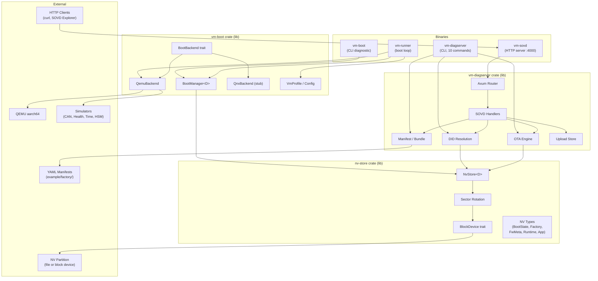
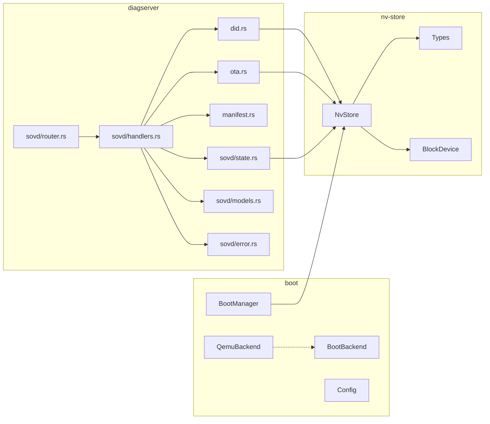
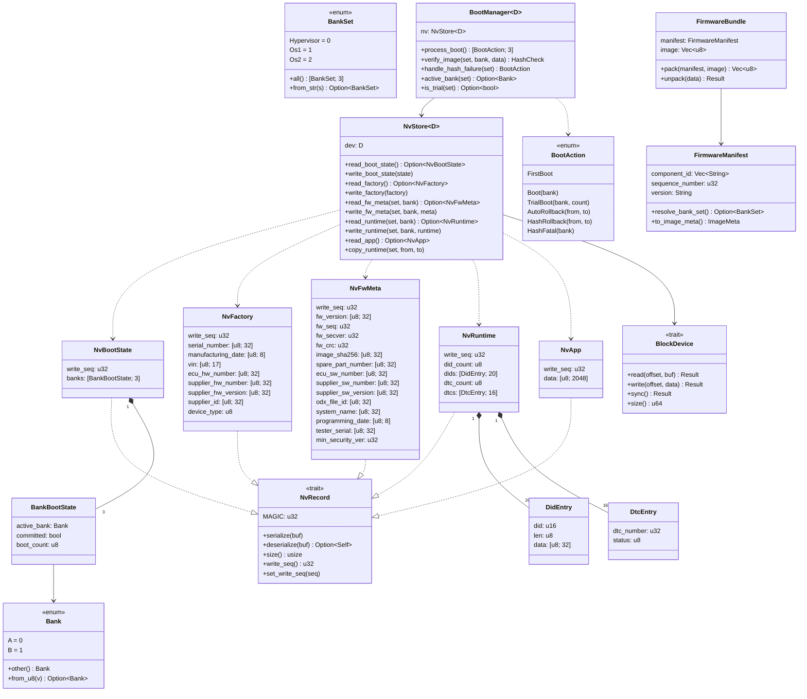
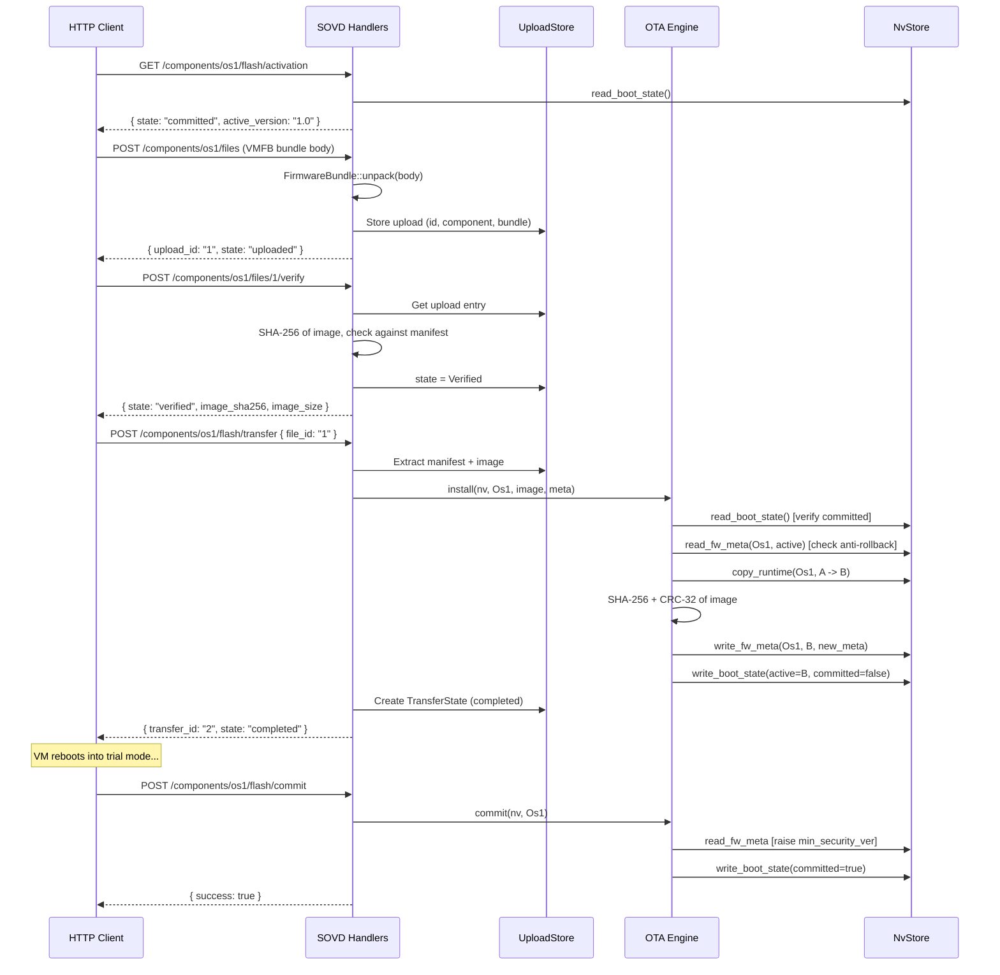
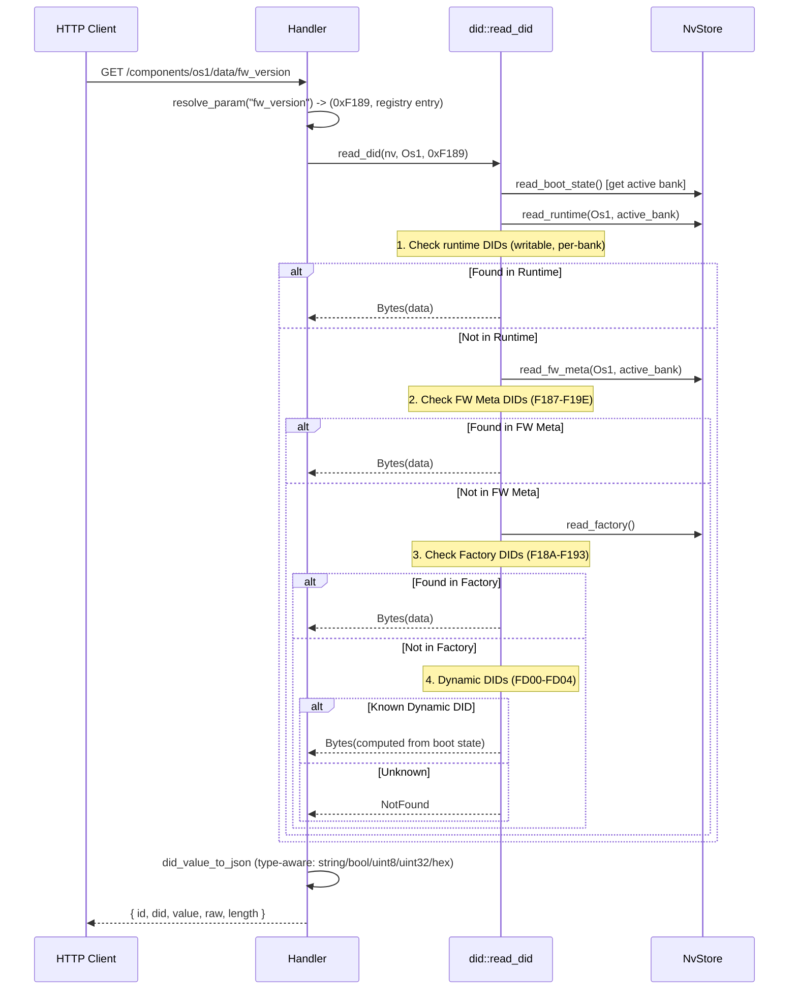
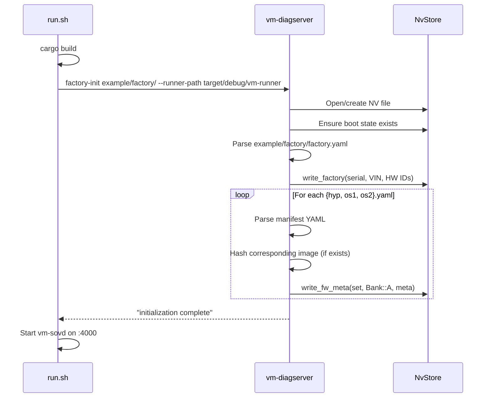

# Architecture: vm-mgr

## Overview

Platform-agnostic VM lifecycle manager for automotive ECUs. Handles A/B bank switching, boot decisions with trial boot and auto-rollback, OTA updates with anti-rollback security, and automotive diagnostics (UDS DIDs, DTCs) via both CLI and SOVD REST API. Supports SUIT-inspired firmware bundles (VMFB format) for packaged updates. Developed and tested on Linux (file-backed storage + QEMU), deployable on any hypervisor (QNX qvm, Xen) via the backend trait.

**Stack:** Rust 2021 edition, Axum 0.8 (HTTP), Tokio (async runtime), SHA-256 (image verification), CRC-32 (sector integrity), serde_yaml (manifests)

| Language | Files | Code | Comments | Blanks |
|----------|-------|------|----------|--------|
| Rust     | 27    | 5626 | 319      | 938    |
| TOML     | 6     | 94   | 3        | 16     |
| YAML     | 3     | 34   | 0        | 4      |
| Shell    | 2     | 81   | 26       | 16     |
| Markdown | 6     | 0    | 980      | 241    |
| **Total**| **44**| **5835** | **1328** | **1215** |

## Project Structure

```
vm-mgr/
+-- Cargo.toml                  # Workspace root (3 crates)
+-- CLAUDE.md                   # AI assistant instructions
+-- README.md                   # Project overview & quick start
+-- scripts/
|   +-- run.sh                  # Boot loop launcher (builds, factory-init, starts SOVD + vm-runner)
|   +-- mkbundle.sh             # Creates VMFB firmware bundle from manifest + image
+-- example/profiles/
|   +-- os1-dev.toml            # QEMU profile: full device stack (CAN, HSM, health, time)
|   +-- os1-minimal.toml        # QEMU profile: network only, quick boot testing
+-- example/
|   +-- factory/                # Example factory provisioning manifests
|   |   +-- factory.yaml        # Serial, VIN, HW IDs
|   |   +-- hyp.yaml            # Hypervisor firmware manifest (version, DIDs)
|   |   +-- os1.yaml            # OS1 firmware manifest (version, DIDs)
|   +-- keys/                   # Generated SUIT signing keys
|   +-- output/                 # Generated SUIT envelopes (os1-v1, os1-v2, os2-v1, os2-v2)
+-- specs/
|   +-- disk-layout.md          # GPT partition table specification
|   +-- nv-store-format.md      # NV partition internal layout & wire formats
|   +-- bank-state-machine.md   # Update lifecycle state machine
+-- crates/
    +-- nv-store/               # NV data types, sector-rotated storage, CRC integrity
    |   +-- src/
    |       +-- lib.rs           # Module exports
    |       +-- types.rs         # NvBootState, NvFactory, NvFwMeta, NvRuntime, NvApp, NvRecord trait
    |       +-- block.rs         # BlockDevice trait, MemBlockDevice, FileBlockDevice
    |       +-- store.rs         # NvStore<D> API, sector rotation read/write, NV layout offsets
    |       +-- tests.rs         # 21 tests (roundtrip, rotation, corruption, isolation, copy-on-update)
    +-- boot/                   # Boot-time logic, backend trait, QEMU/QNX backends
    |   +-- src/
    |       +-- lib.rs           # BootManager, BootAction, HashCheck, BootError
    |       +-- main.rs          # vm-boot CLI binary
    |       +-- bin/runner.rs    # vm-runner boot loop orchestrator (Ctrl+C aware)
    |       +-- backend.rs       # BootBackend trait, BackendError, VmHandle
    |       +-- qemu.rs          # QemuBackend (ivshmem, simulators, QEMU launch, cleanup)
    |       +-- qnx.rs           # QnxBackend (stub for production)
    |       +-- config.rs        # VmProfile, VmConfig, DeviceConfig (TOML, serde)
    |       +-- tests.rs         # 30+ tests (boot cycle, hash verification, config parsing, QEMU args)
    +-- diagserver/             # Diagnostic server: CLI + SOVD REST API + manifest/bundle
        +-- src/
            +-- lib.rs           # Module exports
            +-- main.rs          # vm-diagserver CLI binary (10 commands)
            +-- did.rs           # DID resolution (Runtime > FwMeta > Factory > Dynamic)
            +-- ota.rs           # OTA install/commit/rollback engine
            +-- manifest.rs      # FirmwareManifest, FactoryManifest, FirmwareBundle (VMFB)
            +-- tests.rs         # 50+ unit tests (DID, OTA, manifest, bundle)
            +-- sovd_main.rs     # vm-sovd HTTP server binary (Axum + Tokio)
            +-- sovd_tests.rs    # 30+ HTTP integration tests
            +-- sovd/
                +-- mod.rs       # SOVD module exports
                +-- models.rs    # JSON types + DID parameter registry (21 standard DIDs)
                +-- handlers.rs  # 16 async Axum handler functions
                +-- router.rs    # Route definitions + CORS + 256MB body limit
                +-- state.rs     # AppState<D>, UploadStore, UploadEntry, TransferState
                +-- error.rs     # ApiError -> HTTP status + JSON body (OtaError mapping)
```

## System Architecture



## Module Hierarchy

### nv-store

| Module | Purpose | Key Exports |
|--------|---------|-------------|
| `types` | NV record types and manual LE serialization | `Bank`, `BankSet`, `BankBootState`, `NvBootState`, `NvFactory`, `NvFwMeta`, `NvRuntime`, `NvApp`, `DidEntry`, `DtcEntry`, `NvRecord` trait |
| `block` | Block device abstraction | `BlockDevice` trait, `BlockError`, `MemBlockDevice`, `FileBlockDevice` |
| `store` | High-level NV API with sector rotation | `NvStore<D>`, `read_record`, `write_record`, `layout` module, `SECTOR_SIZE`, `MIN_NV_DEVICE_SIZE` |

**Dependencies:** `crc32fast`

### vm-boot

| Module | Purpose | Key Exports |
|--------|---------|-------------|
| `lib` | Boot decision engine | `BootManager<D>`, `BootAction` (6 variants), `HashCheck`, `BootError` |
| `backend` | Platform abstraction | `BootBackend` trait (5 methods), `BackendError`, `VmHandle` |
| `qemu` | QEMU backend | `QemuBackend` (ivshmem server launch, simulator management, QEMU arg builder, cleanup on Drop) |
| `qnx` | QNX backend (stub) | `QnxBackend` (all methods return "not yet implemented") |
| `config` | TOML profile parsing | `VmProfile`, `VmConfig`, `DeviceConfig` (7 variants: Can, Health, Time, Hsm, Network, Disk, Console) |
| `main` | CLI entry point | `vm-boot <nv-path> [--init]` |
| `bin/runner` | Boot loop orchestrator | `vm-runner --profile <toml> --nv <path> --images <dir> [--sim-dir <dir>] [--init]` |

**Dependencies:** `nv-store`, `sha2`, `serde`, `toml`, `libc`, `ctrlc`

### vm-diagserver

| Module | Purpose | Key Exports |
|--------|---------|-------------|
| `did` | DID resolution (4-layer priority) | `read_did`, `write_did`, `DidValue`, 21 DID constants (F187-F19E, FD00-FD04) |
| `ota` | OTA lifecycle engine | `install`, `commit`, `rollback`, `status`, `OtaError` (6 variants), `ImageMeta`, `InstallResult`, `BankStatus` |
| `manifest` | SUIT-inspired manifests & bundles | `FirmwareManifest`, `FactoryManifest`, `FirmwareBundle` (VMFB pack/unpack), `BundleError` |
| `main` | CLI entry point (10 commands) | `vm-diagserver <nv-path> <command> [args]` |
| `sovd/handlers` | Axum HTTP handlers | 16 async functions (health, components, parameters, faults, flash upload/verify/transfer/commit/rollback) |
| `sovd/router` | Route + middleware setup | `create_router<D>()` (17 routes, CORS, 256MB body limit) |
| `sovd/models` | JSON request/response types | `ComponentInfo`, `ParameterList`, `DataValue`, `FaultList`, `ActivationState`, `TransferProgress`, etc. + `PARAM_REGISTRY` (21 DIDs), `resolve_param()` |
| `sovd/state` | Shared state | `AppState<D>` (`Arc<Mutex<NvStore<D>>>` + `Arc<Mutex<UploadStore>>`), `UploadEntry`, `TransferState`, `UploadPhase`, `TransferPhase` |
| `sovd/error` | Error-to-HTTP mapping | `ApiError` (5 variants) -> HTTP status + JSON, `From<OtaError>` |
| `sovd_main` | HTTP server entry point | `vm-sovd <nv-path> [addr]` (default 0.0.0.0:8080) |

**Dependencies:** `nv-store`, `sha2`, `crc32fast`, `serde`, `serde_json`, `serde_yaml`, `axum`, `tokio`, `tower-http`, `tracing`, `tracing-subscriber`



## Core Types



## Data Flow

### Boot Sequence

```mermaid
sequenceDiagram
    participant R as vm-runner
    participant BM as BootManager
    participant NV as NvStore
    participant Q as QemuBackend
    participant VM as QEMU VM

    R->>NV: Open NV file (re-opens each iteration)
    R->>BM: process_boot()
    BM->>NV: read_boot_state()
    NV-->>BM: NvBootState (3 bank sets)

    alt First Boot
        BM->>NV: write_boot_state(defaults)
        BM-->>R: [FirstBoot; 3]
    else Committed
        BM-->>R: Boot { bank }
    else Trial (count <= 10)
        BM->>NV: write_boot_state(count+1)
        BM-->>R: TrialBoot { bank, count }
    else Trial (count > 10)
        BM->>NV: write_boot_state(other bank, committed)
        BM-->>R: AutoRollback { from, to }
    end

    R->>Q: start_vm(profile, set, bank, image_dir)
    Q->>Q: Start ivshmem-server(s) + wait for socket
    Q->>Q: Start simulators (health, time, CAN, HSM)
    Q->>Q: Sleep 500ms for init
    Q->>Q: build_qemu_args(profile, ivshmem sockets)
    Q->>VM: Launch QEMU (spawn)
    R->>Q: wait_vm(handle)
    VM-->>Q: Exit
    Q-->>R: exit code
    R->>Q: cleanup() [kill processes, remove sockets, clean /dev/shm]
    Note over R: Check Ctrl+C flag, loop restarts
```

### OTA Update via SOVD (Full Flash Flow)



### DID Resolution



### Factory Initialization



## State Management

| State | Type | Location | Reads | Writes |
|-------|------|----------|-------|--------|
| Boot State | `NvBootState` (3x `BankBootState`) | NV offset 0x0, 2 sectors | `process_boot`, `status`, `read_did` (dynamic DIDs), `install`, `commit`, `rollback` | `process_boot`, `install`, `commit`, `rollback` |
| Factory Data | `NvFactory` | NV offset 0x2000, 2 sectors | `read_did` (F18A-F193) | `provision`, `factory-init` (write-once) |
| FW Metadata | `NvFwMeta` (per set, per bank) | NV offset 0x10000+, 4 sectors each | `read_did` (F187-F19E), `verify_image`, `status`, `install` (anti-rollback check) | `install`, `commit` (raise floor), `factory-init` |
| Runtime DIDs/DTCs | `NvRuntime` (per set, per bank) | NV offset varies, 8 sectors each | `read_did`, `list_faults` | `write_did`, `install` (copy-on-update), `clear_faults` |
| App Data | `NvApp` | NV offset 0x4000, 2 sectors | (not yet used by diagserver) | (not yet used by diagserver) |
| SOVD shared NV | `AppState<D>` = `Arc<Mutex<NvStore<D>>>` | In-memory (Tokio) | All SOVD handlers | All mutating handlers |
| Upload Store | `UploadStore` = `Arc<Mutex<{files, transfers}>>` | In-memory (Tokio) | `get_upload_status`, `verify_file`, `start_transfer`, `transfer_progress`, `finalize_transfer` | `upload_file`, `verify_file`, `start_transfer` |
| VM process state | `QemuBackend.host_processes` + `sockets` | In-memory | `is_running`, `wait_vm` | `start_vm`, `stop_vm`, `cleanup`, `Drop` |
| Ctrl+C flag | `AtomicBool` (SeqCst) | In-memory (vm-runner) | Boot loop condition | `ctrlc` signal handler |

**NV State Lifecycle:**
- **Initialized:** First call to `process_boot()`, `vm-boot --init`, or diagserver auto-creates
- **Provisioned:** `factory-init` or `provision` writes factory + FW meta (one-time)
- **Updated:** OTA install writes FW meta + boot state; commit/rollback modifies boot state
- **Persisted:** Every NV write calls `dev.sync()` for power-loss safety
- **Rotated:** Each write goes to next sector slot; reads pick highest valid `write_seq`

## API / Command Reference

### CLI: vm-boot

| Command | Description |
|---------|-------------|
| `vm-boot <nv-path>` | Process boot decisions, print actions for all 3 bank sets, output ACTIVE_HYP/OS1/OS2 |
| `vm-boot <nv-path> --init` | Create NV file if missing, then process boot |

### CLI: vm-runner

| Command | Description |
|---------|-------------|
| `vm-runner --profile <toml> --nv <path> --images <dir> [--sim-dir <dir>] [--init]` | Continuous boot loop: process_boot -> start QEMU -> wait -> cleanup -> repeat. Ctrl+C exits after current VM. |

### CLI: vm-diagserver

| Command | Description |
|---------|-------------|
| `vm-diagserver <nv> status <set>` | Show bank status (active bank, committed, boot count, versions) |
| `vm-diagserver <nv> install <set> <image> <ver> <secver>` | Install OTA image to inactive bank |
| `vm-diagserver <nv> install-bundle <bundle.vmfb>` | Install from VMFB bundle (auto-resolves bank set) |
| `vm-diagserver <nv> commit <set>` | Commit trial bank, raise anti-rollback floor |
| `vm-diagserver <nv> rollback <set>` | Rollback to previous bank |
| `vm-diagserver <nv> read-did <set> <did-hex>` | Read DID value (e.g., F189, 0xFD10) |
| `vm-diagserver <nv> write-did <set> <did-hex> <val>` | Write runtime DID |
| `vm-diagserver <nv> provision <serial> <vin>` | Write factory data (one-time) |
| `vm-diagserver <nv> factory-init <dir> [--runner-path <path>]` | Initialize from YAML manifests in directory |
| `vm-diagserver _ pack <manifest.yaml> <image> <output.vmfb>` | Create VMFB firmware bundle |

### HTTP: vm-sovd (SOVD REST API)

| Method | Path | Description |
|--------|------|-------------|
| GET | `/health` | Health check (`{ status: "ok", components: 3 }`) |
| GET | `/vehicle/v1/components` | List components (hyp, os1, os2) with capabilities |
| GET | `/vehicle/v1/components/{id}` | Get single component info |
| GET | `/vehicle/v1/components/{id}/data` | List all DIDs (21 standard + runtime DIDs) |
| GET | `/vehicle/v1/components/{id}/data/{param}` | Read DID by name (`fw_version`) or hex (`F189`, `0xF189`) |
| PUT | `/vehicle/v1/components/{id}/data/{param}` | Write runtime DID (`{"value": "..."}`) — read-only DIDs return 403 |
| GET | `/vehicle/v1/components/{id}/faults` | List DTCs with status and active flag |
| DELETE | `/vehicle/v1/components/{id}/faults` | Clear all DTCs |
| POST | `/vehicle/v1/components/{id}/files` | Upload VMFB firmware bundle (octet-stream body) |
| GET | `/vehicle/v1/components/{id}/files/{upload_id}` | Get upload status (uploaded/verified) |
| POST | `/vehicle/v1/components/{id}/files/{upload_id}/verify` | Verify image hash and size against manifest |
| POST | `/vehicle/v1/components/{id}/flash/transfer` | Start flash transfer (`{"file_id": "..."}`) |
| GET | `/vehicle/v1/components/{id}/flash/transfer/{id}` | Get transfer progress (percent) |
| PUT | `/vehicle/v1/components/{id}/flash/transfer/{id}` | Finalize transfer |
| GET | `/vehicle/v1/components/{id}/flash/activation` | Get activation state (committed/trial, versions) |
| POST | `/vehicle/v1/components/{id}/flash/commit` | Commit trial bank |
| POST | `/vehicle/v1/components/{id}/flash/rollback` | Rollback trial bank |

### Script: run.sh

| Command | Description |
|---------|-------------|
| `./example/run.sh` | Build, factory-init, start SOVD server on :4000 |
| `./example/run.sh --profile <toml> --images <dir>` | Full boot loop + SOVD server |
| `./example/run.sh --no-init` | Skip factory initialization |
| `./example/run.sh --addr <host:port>` | Custom SOVD bind address |

### Script: mkbundle.sh

| Command | Description |
|---------|-------------|
| `./scripts/mkbundle.sh <manifest.yaml> <image> <output.vmfb>` | Create VMFB firmware bundle |

## External Dependencies

### Runtime

| Crate | Version | Purpose | Replaceable? |
|-------|---------|---------|-------------|
| `crc32fast` | 1 | CRC-32 for NV sector integrity | Any CRC-32 lib |
| `sha2` | 0.10 | SHA-256 image verification | Any SHA-256 lib |
| `serde` | 1 | Serialization framework (TOML, JSON, YAML) | Core dependency |
| `toml` | 0.8 | VM profile config parsing | Any TOML parser |
| `serde_json` | 1 | SOVD API JSON request/response | Tied to Axum |
| `serde_yaml` | 0.9 | Firmware/factory manifest parsing | Any YAML parser |
| `axum` | 0.8 | HTTP framework for SOVD server | Any async HTTP framework |
| `tokio` | 1 | Async runtime (rt-multi-thread, macros, net) | Required by Axum |
| `tower-http` | 0.6 | CORS middleware | Any CORS middleware |
| `tracing` | 0.1 | Structured logging | Any logging framework |
| `tracing-subscriber` | 0.3 | Log output with env-filter | Any log subscriber |
| `libc` | 0.2 | Process existence check (`kill(pid, 0)`) | Direct syscall |
| `ctrlc` | 3 | Ctrl+C signal handling in boot loop | Manual signal handling |

### Dev/Test Only

| Crate | Version | Purpose |
|-------|---------|---------|
| `http-body-util` | 0.1 | Body extraction in SOVD integration tests |
| `tower` | 0.5 | `ServiceExt::oneshot()` for test HTTP calls |
| `hyper` | 1 | Low-level HTTP for test request building |

## Design Patterns & Decisions

### Generic over BlockDevice
`NvStore<D: BlockDevice>` and `BootManager<D>` are parameterized over the storage backend. Tests use `MemBlockDevice` (in-memory), development uses `FileBlockDevice`, production targets raw block devices. This makes all logic testable without I/O.

### Sector Rotation for Power-Loss Safety
Each NV region has 2-8 rotated sectors. Writes go to the sector with the lowest `write_seq` (or first empty/uninitialized sector); reads pick the sector with the highest valid `write_seq` and correct CRC. This provides: wear leveling, atomic writes (old sector valid until new one committed), and automatic corruption recovery (skip sectors with bad CRC).

### NvRecord Trait for Uniform Serialization
All NV types implement `NvRecord` with a common pattern: 4-byte magic, 4-byte write_seq, payload, CRC at sector end. This allows generic `read_record<T>` / `write_record<T>` functions. Wire format is manual little-endian byte packing (no serde) for deterministic binary layout.

### Backend Trait for Hypervisor Abstraction
`BootBackend` trait abstracts VM launch/stop/wait/cleanup. `QemuBackend` is the full development implementation (ivshmem-server management, simulator lifecycle, QEMU arg construction, automatic cleanup on Drop). `QnxBackend` is a placeholder for production QNX qvm integration.

### DID Resolution Priority Chain
Runtime (writable, per-bank) > FW Meta (software identity, per-bank) > Factory (hardware identity, shared) > Dynamic (computed from boot state). This mirrors automotive UDS conventions where workshop-written values override factory defaults. Dynamic DIDs (0xFD00-FD04) are computed on-the-fly from boot state.

### Copy-on-Update
Before OTA writes to the inactive bank, runtime DIDs and DTCs are cloned from the active bank. This preserves user configuration across updates. If the source bank has no runtime data, an empty default is written.

### Anti-Rollback Floor
Each bank tracks `min_security_ver`. The floor is only raised on explicit commit (not on install), allowing rollback during trial. Once raised, images with lower security versions are permanently rejected. The floor is preserved from active bank to target bank during install.

### Independent Bank Sets
Hypervisor, OS1, and OS2 have completely independent state machines with separate NV regions. This enables staged rollouts: update OS1, verify, commit, then update OS2. Different bank sets can be in different states simultaneously.

### VMFB Firmware Bundle Format
SUIT-inspired binary format: 4-byte magic "VMFB", 4-byte version, 4-byte manifest length, YAML manifest, raw image bytes. Enables single-file OTA uploads containing both metadata and payload.

### Arc<Mutex<NvStore>> for SOVD Concurrency
The HTTP server wraps `NvStore` in `Arc<Mutex<>>` so multiple Axum handlers can safely share mutable access. Lock scope is kept minimal (per-handler). Upload state is separately mutex'd to avoid contention.

### Fluent Builder for QemuBackend
`QemuBackend::new().qemu_bin(...).sim_dir(...).try_kvm(true)` - optional configuration without complex constructors. KVM is auto-detected on aarch64 with `/dev/kvm`.

### QEMU Device Enumeration
Devices are added in reverse order in QEMU args because the virt machine enumerates PCI devices in reverse. This ensures rootfs is always `/dev/vda`, data is `/dev/vdb`, etc.

## Recreation Blueprint

### 1. Project Scaffolding

```bash
cargo init --name vm-mgr
# Convert to workspace
mkdir -p crates/{nv-store,boot,diagserver}/src
mkdir -p specs profiles firmware scripts
# Edit Cargo.toml: [workspace] resolver = "2", members = [...]
```

### 2. Core Types to Define First (nv-store)

1. `Bank` enum (A/B) with `other()` and `from_u8()`, and `BankSet` enum (Hypervisor/Os1/Os2) with `from_str()` and `all()`
2. `BlockDevice` trait with `read`, `write`, `sync`, `size`
3. `MemBlockDevice` (for tests) and `FileBlockDevice` (open + create)
4. `NvRecord` trait with `MAGIC`, `serialize`, `deserialize`, `size`, `write_seq`, `set_write_seq`
5. Helper functions: `put_u32_le`, `get_u32_le`, `put_u16_le`, `get_u16_le`, `put_bytes`, `get_bytes<N>`
6. Wire format structs: `NvBootState` (20 bytes), `NvFactory` (200 bytes), `NvFwMeta` (324 bytes), `NvRuntime` (792 bytes), `NvApp` (2060 bytes)
7. `DidEntry` (35 bytes wire) and `DtcEntry` (5 bytes wire)

**Critical detail:** All serialization is manual little-endian byte packing (no serde for wire format). CRC-32 covers bytes `[0..4092]`, stored at `[4092..4096]`. Sector size is exactly 4096 bytes.

### 3. Build Order

| Phase | Crate | Module | Depends On |
|-------|-------|--------|------------|
| 1 | nv-store | `types`, `block` | crc32fast |
| 2 | nv-store | `store` (rotation + NvStore<D>) | types, block |
| 3 | boot | `lib` (BootManager) | nv-store, sha2 |
| 4 | boot | `config` (VmProfile) | serde, toml |
| 5 | boot | `backend`, `qemu`, `qnx` | config, libc |
| 6 | boot | `main`, `bin/runner` | lib, backend, config, ctrlc |
| 7 | diagserver | `did` | nv-store |
| 8 | diagserver | `ota` | nv-store, sha2, crc32fast |
| 9 | diagserver | `manifest` | ota, serde_yaml |
| 10 | diagserver | `main` (CLI, 10 commands) | did, ota, manifest |
| 11 | diagserver | `sovd/*` (HTTP server) | did, ota, manifest, axum, tokio |
| 12 | diagserver | `sovd_main` | sovd/router |

### 4. Key Implementation Notes

- **NV partition layout offsets** are hardcoded constants in `store.rs:layout`. Each bank set's base is at `0x010000 + set_index * 0x018000`. FW Meta A/B and Runtime A/B are at fixed relative offsets within each bank set.
- **Sector rotation**: always scan all sectors to find max `write_seq`. Never assume write order. An empty sector (wrong magic) is preferred over overwriting the oldest valid one. The sequence number wraps with `wrapping_add(1)`.
- **QEMU backend**: ivshmem-server sockets at `/tmp/bali-ivshmem-*.sock`, shared memory at `/dev/shm/ivshmem-*`. Stale sockets/shm are cleaned before launch. Wait up to 5s (50 * 100ms) for socket creation. 500ms delay after simulator start before QEMU launch.
- **Image naming convention**: `{set}-{bank}.img` (e.g., `os1-a.img`, `hyp-b.img`).
- **DID hex parsing**: Both SOVD handlers and CLI accept `"F189"`, `"0xF189"`, and `"0xf189"` formats.
- **Factory provision is write-once**: no update path. The `factory-init` command skips if data exists.
- **SOVD handler locking**: acquire mutex, do NV operations, drop lock before returning. Upload store has separate mutex to avoid contention with NV.
- **VMFB bundle**: Magic `VMFB` (4 bytes), version 1 (u32 LE), manifest YAML length (u32 LE), YAML bytes, image bytes. `component_id` last element resolves to BankSet.
- **QEMU cleanup on Drop**: `QemuBackend` implements `Drop` to kill all host processes and clean up sockets/shm, preventing resource leaks.
- **vm-runner re-opens NV** each loop iteration because the diagserver may have written to it concurrently.

### 5. Configuration & Environment

| Variable | Default | Purpose |
|----------|---------|---------|
| `VM_MGR_NV` | `/tmp/vm-mgr-nv.bin` | NV store file path (run.sh) |
| `VM_MGR_SOVD_ADDR` | `0.0.0.0:4000` | SOVD server bind address (run.sh) |
| `RUST_LOG` | (none) | Tracing filter (e.g., `vm_sovd=info,tower_http=debug`) |

### 6. Testing Approach

- **Unit tests** use `MemBlockDevice` (zero I/O, deterministic, instant)
- **NV store tests** (21): roundtrip serialization, sector rotation, CRC corruption detection/fallback, bank isolation, copy-on-update
- **Boot tests** (30+): first boot, committed boot, trial increment, auto-rollback at 10, hash verification, bank set independence, full OTA cycle, config parsing, QEMU command generation
- **Diagserver tests** (50+): DID resolution priority, factory/FW meta/runtime DID reads, runtime write/update/full, dynamic DIDs, OTA install/commit/rollback lifecycle, anti-rollback enforcement, manifest parsing, bundle pack/unpack
- **SOVD integration tests** (30+): HTTP handler tests using `tower::ServiceExt::oneshot()` (no real server), covering all endpoints, error cases (404, 403, 409), full flash upload/verify/transfer/commit flow, CORS headers
- **No external test dependencies** (no Docker, no network, no filesystem for unit tests)
- **Total:** ~100+ tests across the workspace (`cargo test`)
